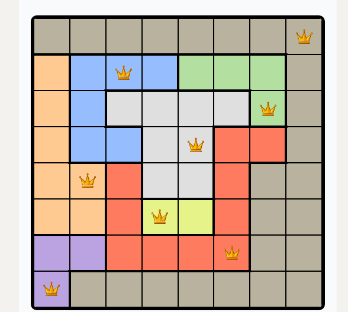

# Queens LinkedIn Solver

> Tugas Kecil 1 IF2211 Strategi Algoritma.

  

## Deskripsi Singkat Program

Queens (game pada platform LinkedIn) adalah permainan logika di mana pemain harus menempatkan N buah ratu pada papan berwarna dengan aturan:

- Setiap baris hanya boleh berisi tepat satu ratu.
- Setiap kolom hanya boleh berisi tepat satu ratu.
- Setiap wilayah warna (region) hanya boleh berisi tepat satu ratu.
- Tidak ada dua ratu yang boleh saling bertetangga, termasuk secara diagonal.

Jumlah ratu yang ditempatkan sama dengan jumlah baris, kolom, dan wilayah warna (N).

Program Queens Linkedin Solver ini adalah program yang dapat menemukan satu solusi penempatan queen pada suatu papan berwarna yang diberikan, atau menampilkan bahwa tidak ada solusi yang valid. Program melakukan pencarian solusi menggunakan algoritma brute force. Program ini merupakan aplikasi desktop untuk menyelesaikan permainan Queens. Aplikasi mendukung input dan output dalam format gambar maupun berkas teks (.txt).

### Fitur

- Antarmuka pengguna interaktif dengan pembaruan proses brute force secara langsung (live update).
- Input papan warna secara manual melalui UI.
- Ekspor hasil penyelesaian dalam format gambar atau teks.

## Catatan Penting

Repository ini menyertakan file executable dalam bentuk .zip untuk mempermudah proses menjalankan program tanpa perlu melakukan kompilasi ulang. Trade-off dari pendekatan ini adalah ukuran repository menjadi besar (>50 MB) karena menyertakan file binary beserta dependensinya.

## Requirement

### Untuk Kompilasi (Windows)

- Windows 64-bit
- CMake ≥ 3.x
- Ninja (atau generator lain)
- Qt 6.10.2 (versi MinGW 64-bit)
- MinGW 64-bit compiler

### Untuk Kompilasi (WSL/Linux)

- Linux 64-bit atau WSL2
- CMake ≥ 3.x
- Ninja
- Qt 6 development package (qt6-base-dev)
- g++ compiler

## Menjalankan Program

Ekstrak folder /bin sesuai sistem operasi yang digunakan:

- bin/windows/ untuk Windows
- bin/linux/ untuk Linux atau WSL

Jalankan executable:

- Windows: Tucil1_13524053.exe
- Linux / WSL: Jalankan melalui terminal `./Tucil1_13524053`

### Catatan

- Pada Linux/WSL, pastikan file memiliki permission executable: `chmod +x Tucil1_13524053`
- Pada WSL, GUI hanya berjalan jika menggunakan WSL2 dengan WSLg atau X server.

## Cara Kompilasi Program

Program dapat dikompilasi secara native pada masing-masing sistem operasi menggunakan CMake dan Qt 6.

### Windows (Qt 6.10.2 MinGW 64-bit)

1. Pastikan environment variable berikut sudah diset: `CMAKE_PREFIX_PATH=C:\Qt\6.10.2\mingw_64`
2. Kemudian dari root project jalankan: `cmake -S . -B build -G Ninja` `cmake --build build`
3. Executable akan dihasilkan di folder: `build/`
4. Untuk menjalankan di Windows tanpa instalasi Qt, lakukan deployment: `cd build` `C:\Qt\6.10.2\mingw_64\bin\windeployqt.exe Tucil1_13524053.exe`

### Linux / WSL

1. Install dependency (Ubuntu-based): `sudo apt update` `sudo apt install cmake ninja-build qt6-base-dev g++`
2. Build dari root project: `cmake -S . -B build -G Ninja` `cmake --build build`
3. Executable akan dihasilkan di: `build/Tucil1_13524053`

## Cara Menggunakan Program

1. Memasukkan papan: Masukkan papan warna secara manual melalui antarmuka (UI) **atau** Impor papan dari file .txt atau gambar (.png .jpg .bmp).

2. Menjalankan solver:

- Tekan tombol Solve untuk memulai proses pencarian solusi.
- Program akan menampilkan proses brute force secara real-time.
- Jika proses brute force terasa terlalu lama, tekan tombol stop untuk memberhentikan proses
- Jika solusi ditemukan, posisi ratu akan ditampilkan pada papan.
- Jika tidak ada solusi valid, program akan menampilkan informasi (State) bahwa solusi tidak ditemukan.

3. Menyimpan hasil: Hasil solusi dapat diekspor dalam format gambar (.png) **atau** format teks (.txt).

## Author

Muhammad Haris Putra Sulastianto  
13524053  
Teknik Informatika, ITB.  
About me: [https://mhps-null.vercel.app/](https://mhps-null.vercel.app/)
